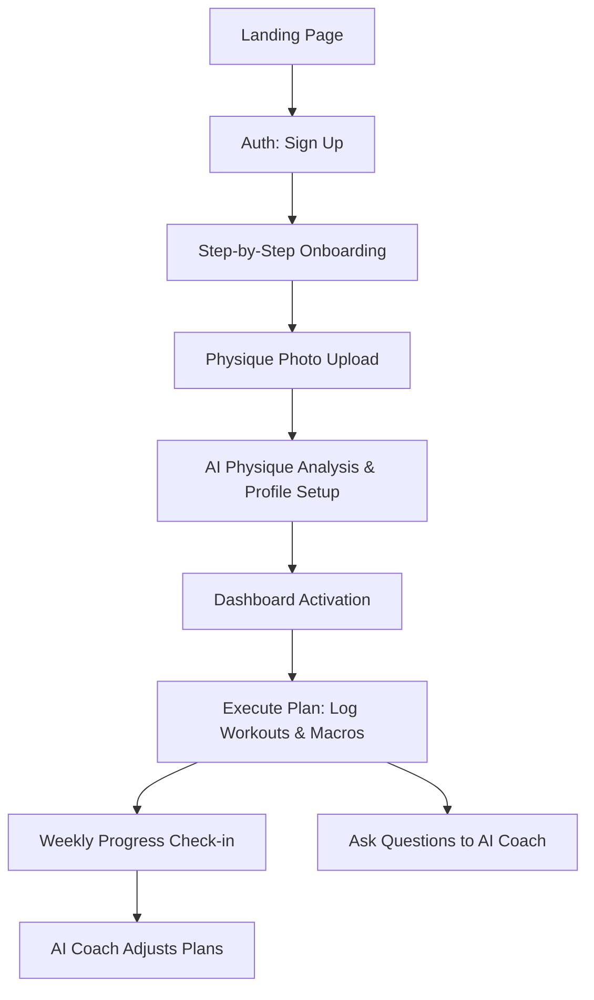

# 01 — Product Requirements Document (PRD)

---

## 1. Executive Summary

This Product Requirements Document (PRD) defines the functional and non-functional requirements for the Minimum Viable Product (MVP) of **Zyvora**, an AI-powered fitness coaching platform. 

The primary goal of the MVP is to establish a high-trust, personalized, and adaptive fitness coaching relationship between the user and the Zyvora AI. By focusing on core features—onboarding, computer-vision physique analysis, dynamically generated workout and nutrition plans, progress tracking, and a conversational AI coach with long-term memory—the MVP will validate the core hypothesis: that AI can deliver the personalization and outcomes of a human coach at consumer SaaS scale.

---

## 2. Product Overview

Zyvora is a mobile-responsive web application that acts as a comprehensive, evidence-informed digital fitness coach. Unlike static fitness tracking tools or generic plan builders, Zyvora establishes an ongoing feedback loop. The user inputs their physical context, goals, and constraints; the AI analyzes their baseline physique and generates a unified plan; the user tracks their actions; the AI coach monitors results and adapts programming during weekly check-ins.

---

## 3. User Personas

### Persona A: Marcus — The Plateaued Intermediate Lifter
* **Age:** 31
* **Occupation:** Software Engineer
* **Fitness Level:** Intermediate (3 years of inconsistent training)
* **Goal:** Body Recomposition (reduce body fat, build lean mass)
* **Pain Points:** Hard plateaus, confusing online fitness advice, difficulty balancing nutrition with a demanding desk job, lack of progress tracking and structural program adjustments.
* **Zyvora Value:** Structured progression, data-driven nutrition adaptations, and explanations of the program's underlying rationale.

### Persona B: Sarah — The Busy Professional Beginner
* **Age:** 27
* **Occupation:** Marketing Manager
* **Fitness Level:** Beginner
* **Goal:** Fat Loss & Functional Strength
* **Pain Points:** Intimidated by the gym, does not know how to design a workout, struggles with dietary consistency, has minor lower back pain from sitting, needs low-friction guidance.
* **Zyvora Value:** Simple, clear workout steps tailored to available equipment (home gym), basic macronutrient targeting, and a supportive, non-judgmental conversational coach.

---

## 4. User Journey

1. **Discovery & Onboarding:** The user lands on the landing page, reads the value proposition, and signs up. They complete an onboarding flow specifying their background, injuries, schedule, and equipment.
2. **Analysis:** The user uploads front, side, and back photos. The AI scans the images to estimate body composition, posture, and muscle distribution, returning a professional analysis summary.
3. **Plan Generation:** The system constructs customized, periodized training blocks and caloric/macronutrient splits based on the onboarding data and physique analysis.
4. **Active Tracking:** The user logs their daily workouts and calorie metrics via the dashboard.
5. **Continuous Adaptation:** During the weekly check-in, the AI coach analyzes the past week's logs, updates long-term memory, explains current progress, and adjusts the workout/nutrition plans for the coming week.
6. **Support:** The user interacts with the AI Coach in a chat interface whenever they have questions about exercise execution, motivation, or dietary modifications.

---

## 5. MVP Scope

### Included in MVP
* **Landing Page:** Responsive conversion page detailing features, pricing, and science-based approach.
* **Authentication:** Secure email/password and Google OAuth signup/login.
* **User Profile & Onboarding:** Multistep intake capturing biological details, experience, equipment inventory, goals, and constraints.
* **Physique Photo Upload:** Secure upload interface with privacy guidelines and masking tools.
* **AI Physique Analysis:** Visual analysis generating estimations of body fat percentage, waist-to-hip ratio, and localized muscular development.
* **Workout Generator:** Algorithmic builder generating multi-week workout templates (sets, reps, progression models) tailored to equipment, frequency, and goals.
* **Nutrition Planner:** Daily calorie and macronutrient planner with custom adjustment mechanisms.
* **AI Coach (Chat & Memory):** Persistent chat interface powered by an LLM backend utilizing a long-term memory vector database.
* **Dashboard:** Unified day-to-day display showing today's workouts, macro targets, and quick-log buttons.
* **Progress Tracking:** Standardized log sheets for workouts, weight, measurements, and upload archives for photos.
* **Notifications:** Basic programmatic email alerts and push alerts for workouts, check-ins, and milestones.
* **Subscription Management:** Paywall integration for a premium tier including Stripe payments.
* **Basic Settings:** Accountability settings, privacy controls, data export/deletion.
* **Basic Admin Portal:** Customer support view to override plans, check system performance, and access user debug logs.

### Not Included in MVP
* Mobile App Store Native Builds (iOS/Android Native) — App will be launched as a mobile-optimized Progressive Web App (PWA).
* Third-party wearable integration (Apple Health, Garmin, Whoop, Fitbit).
* Automated barcode scanner or food database lookup for macro tracking.
* Video analysis of exercise form (real-time movement correction).
* Community features, group challenges, or user-to-user sharing.
* Live human-in-the-loop coaching oversight (fully AI-driven).

### Planned for Future Versions (Post-MVP)
* Wearable telemetry synchronization for adaptive recovery modeling.
* Generative video form checks for compound lifts (Squat, Bench, Deadlift).
* Meal plan recipe generation matching exact macro targets.
* In-app barcode scanning for automated diet tracking.
* Group training circles and localized community hubs.

---

## 6. Functional Requirements

### 6.1 Landing Page (LDG)
* **Objective:** Capture user traffic, showcase the product's evidence-based value proposition, outline subscription pricing, and drive conversions to registration.
* **Functional Requirements:**
  * **LDG-001:** The system must render a fully responsive landing page optimized for desktop, tablet, and mobile browsers.
  * **LDG-002:** The landing page must feature a prominent "Start Free Trial" Call-To-Action (CTA) leading directly to the signup screen.
  * **LDG-003:** The landing page must contain sections detailing features: Physique Analysis, Dynamic Programming, and the AI Conversational Coach.
  * **LDG-004:** The landing page must display a transparent pricing matrix indicating Free vs. Premium tiers.
  * **LDG-005:** The landing page must showcase a scientific disclaimer link regarding the coaching platform's scope of advice.
* **User Stories:**
  * As a prospective user, I want to review the platform features and subscription pricing so that I can decide whether to sign up for a trial.
* **Acceptance Criteria:**
  * Viewport scalability from 320px width to 4K resolutions without layout overflow.
  * All CTAs link to `/register` with UTM parameters preserved.
  * Pricing tables clearly state monthly renewal cost and subscription terms.
* **Edge Cases:**
  * Javascript disabled in browser: The landing page must render static CSS layouts and present a clear notice that interactive setup requires Javascript.
* **Technical Notes:**
  * Optimize media assets (images, svg vectors) for sub-second page loads.
* **Dependencies:**
  * None.

---

### 6.2 Authentication (AUTH)
* **Objective:** Authenticate user registration and logins securely, maintaining individual profile separation and data privacy.
* **Functional Requirements:**
  * **AUTH-001:** The system must allow users to create an account using a unique email address and a password meeting complexity standards (8+ characters, 1 number, 1 uppercase, 1 special character).
  * **AUTH-002:** The system must support registration and authentication via Google OAuth 2.0.
  * **AUTH-003:** The system must require email verification before activating new email-registered accounts.
  * **AUTH-004:** The system must provide a secure "Forgot Password" self-service recovery flow via email verification tokens.
  * **AUTH-005:** The system must invalidate active user sessions immediately upon password changes or when logout is requested.
* **User Stories:**
  * As a user, I want to create a secure account and log in quickly so that my personal fitness data remains confidential and private.
* **Acceptance Criteria:**
  * Failed login attempts return generic validation messages ("Invalid credentials") to prevent account enumeration.
  * Recovery tokens expire precisely 60 minutes after generation.
  * Redirect users to the onboarding flow on initial registration, or to the dashboard on subsequent logins.
* **Edge Cases:**
  * Account creation with an email that is already registered: The system must fail silently or direct the user to the login screen without revealing specific database state, ensuring account privacy.
* **Technical Notes:**
  * Implement rate limiting on `/login` and `/register` endpoints (maximum 5 attempts per minute per IP address).
* **Dependencies:**
  * SMTP service for recovery/verification emails.

---

### 6.3 User Profile (PROF)
* **Objective:** Maintain structural, static, and dynamic attributes of the user to feed downstream programming algorithms.
* **Functional Requirements:**
  * **PROF-001:** The system must store user metrics: Name, Date of Birth, Biological Sex (Male/Female, required for baseline metabolic/bodyfat math), Current Weight, Target Weight, and Height.
  * **PROF-002:** The system must support metric (kg, cm) and imperial (lbs, inches) systems, dynamically converting stored values based on user preference.
  * **PROF-003:** The system must store workout preferences: fitness level (Beginner/Intermediate/Advanced), target training frequency (2-6 days/week), and location profile (Gym/Home/Home with dumbbells).
  * **PROF-004:** The system must store physiological constraints: active injuries, chronic pain areas, and food allergies/dietary restrictions (e.g., Vegan, Keto, Gluten-free).
* **User Stories:**
  * As a user, I want to configure my physical profile and preferences so that the system generates plans targeted to my actual life constraints.
* **Acceptance Criteria:**
  * Switching unit settings instantly converts all values on screen without losing precision in the underlying database.
  * Profiles with empty required fields block the system from initiating program generation.
* **Edge Cases:**
  * User selects contradictory preferences (e.g., Target training frequency: 6 days/week, Fitness experience: absolute beginner): The system must generate a UI notice suggesting a more realistic 3-4 day training frequency.
* **Technical Notes:**
  * Validate dates to prevent values in the future or unrealistic age targets (e.g., DOB setting age > 100).
* **Dependencies:**
  * AUTH module.

---

### 6.4 Onboarding (ONB)
* **Objective:** Walk the user through a low-friction, multi-step intake wizard to gather core profile details and initialize their coaching plans.
* **Functional Requirements:**
  * **ONB-001:** The system must provide a progressive, multi-step onboarding wizard. Progress must be saved locally at each step to prevent data loss on browser refresh.
  * **ONB-002:** Step 1 must collect basic demographics (Age, Gender, Weight, Height, Units).
  * **ONB-003:** Step 2 must collect goals (Fat Loss, Muscle Gain, Recomposition, General Fitness) and target timelines.
  * **ONB-004:** Step 3 must collect physical history (experience level, injury checklist, dietary restrictions).
  * **ONB-005:** Step 4 must collect training logistics (equipment availability, days/week commitment, preferred workout duration).
  * **ONB-006:** The onboarding sequence must end with a transition to the Physique Photo Upload step, preventing dashboard access until onboarding is completed.
* **User Stories:**
  * As a new user, I want a structured onboarding flow that guides me through profile configuration without overwhelming me.
* **Acceptance Criteria:**
  * The wizard display shows a clear percentage or step-based progress indicator.
  * Clicking "Back" preserves previously inputted answers.
  * Validation rules ensure all fields in a step are completed before the "Next" button becomes active.
* **Edge Cases:**
  * User closes the browser halfway through onboarding: Upon logging back in, the system must detect the incomplete status and return the user to the exact step they left off.
* **Technical Notes:**
  * Persist partial onboarding state in the user database record under an `onboarding_status` flag.
* **Dependencies:**
  * AUTH, PROF modules.

---

### 6.5 Physique Photo Upload (PHY)
* **Objective:** Enable secure, private uploads of progress photos for AI body composition analysis and historical comparisons.
* **Functional Requirements:**
  * **PHY-001:** The system must provide a secure photo uploader allowing three images: Front View, Side View, and Back View.
  * **PHY-002:** The system must display clear posing guidelines, lighting requirements, and dress recommendations (e.g., swimwear or form-fitting clothing) inside the interface.
  * **PHY-003:** The system must provide a client-side face-blurring/cropping tool to anonymize images before upload.
  * **PHY-004:** The system must restrict file uploads to standard web image formats (JPEG, PNG, WebP) with a maximum size limit of 10MB per file.
  * **PHY-005:** The system must store images in an encrypted object storage bucket with short-lived, pre-signed URL access.
* **User Stories:**
  * As a privacy-conscious user, I want to blur my face from my physique photos before uploading them so that my personal identity is protected.
* **Acceptance Criteria:**
  * Uploading files of invalid types (e.g., PDF, MP4) triggers a user-friendly error message.
  * Uploaded images are stored with metadata linking them to a specific user and timestamp.
  * The interface confirms image uploads with visual thumbnails.
* **Edge Cases:**
  * Upload timeout or network failure during submission: The system must display a retry prompt without breaking the onboarding process.
* **Technical Notes:**
  * Process face blurring client-side via HTML5 canvas manipulation to ensure raw un-blurred images never touch Zyvora servers.
* **Dependencies:**
  * ONB module.

---

### 6.6 AI Physique Analysis (AIPHY)
* **Objective:** Use computer vision models to evaluate user physique photos and extract estimates of body fat, waist-to-hip ratio, and posture/symmetry profiles.
* **Functional Requirements:**
  * **AIPHY-001:** The system must process uploaded front, side, and back photos using a visual analysis model to estimate body composition.
  * **AIPHY-002:** The analysis must calculate and return estimated Body Fat Percentage (with a +/- 2% confidence interval range).
  * **AIPHY-003:** The analysis must calculate waist-to-hip ratio and evaluate frame structure (e.g., shoulder-to-waist ratio).
  * **AIPHY-004:** The system must generate a textual "Physique Synthesis" outlining localized fat storage trends, muscle balance, and postural notes (e.g., anterior pelvic tilt).
  * **AIPHY-005:** The system must present the analysis output to the user alongside a disclaimer clarifying that the calculations are algorithmic estimations, not medical diagnoses.
  * **AIPHY-006:** The system must allow users to override the AI's body fat estimate if they have a verified DEXA scan or caliper reading.
* **User Stories:**
  * As a user, I want a precise, visual-based evaluation of my current physique details so that my training and nutrition plans are calculated from an accurate baseline.
* **Acceptance Criteria:**
  * AI analysis triggers immediately upon photo upload validation and outputs results in under 15 seconds.
  * All metrics display with clear confidence intervals.
  * Overridden values update the baseline parameters for downstream generator algorithms instantly.
* **Edge Cases:**
  * Poor lighting or low-quality photos fail model requirements: The system must flag the error, present an illustrative explanation of why the photo was rejected (e.g., "Too dark", "No clear body outline"), and ask for a re-upload.
* **Technical Notes:**
  * Run parsing scripts asynchronously, using webhooks or long-polling client-side to check completion state.
* **Dependencies:**
  * PHY module.

---

### 6.7 Workout Generator (WK)
* **Objective:** Program customized training splits, exercise selections, volume, intensity, and progression rules based on user metrics and preferences.
* **Functional Requirements:**
  * **WK-001:** The system must generate a structured training plan (e.g., 4-week training block) outlining specific training days, exercise selection, sets, target reps, RPE (Rate of Perceived Exertion), and rest periods.
  * **WK-002:** The exercise selection must adapt to the user's available equipment profile (e.g., Home workouts swap barbell movements for dumbbell/bodyweight variations).
  * **WK-003:** The generator must implement built-in exercise substitutions. If a movement causes joint pain or is unavailable, the user can click "Swap Exercise" to receive a bio-mechanically equivalent alternative.
  * **WK-004:** The system must include exercise descriptions, execution cues, and tracking forms for every movement.
  * **WK-005:** The workout plan must avoid exercises flagged as constraints based on user injury profiles (e.g., swap barbell squats for leg extensions if lower back injury is flagged).
* **User Stories:**
  * As an intermediate lifter, I want to receive a program that incorporates progressive overload and matches my gym equipment, so that I don't waste time on generic templates.
* **Acceptance Criteria:**
  * Generates the plan in under 5 seconds during the onboarding resolution state.
  * The plan adapts logically if training days are changed by the user (e.g., shifting from 4 days to 3 days re-allocates volume).
  * All exercises have text-based execution cues.
* **Edge Cases:**
  * User flags conflicts in equipment (e.g., selects "Home Gym" but selects exercises requiring a leg press machine): The system must fallback to dumbbell/bodyweight squats or lunges automatically.
* **Technical Notes:**
  * Program generation should follow rules-based templates validated by evidence-informed training guidelines before passing metrics to dynamic tuning layers.
* **Dependencies:**
  * PROF, AIPHY modules.

---

### 6.8 Nutrition Planner (NUT)
* **Objective:** Calculate daily caloric targets, macronutrient targets (protein, fat, carbohydrates), hydration requirements, and suggest structural meal configurations.
* **Functional Requirements:**
  * **NUT-001:** The system must calculate a baseline Total Daily Energy Expenditure (TDEE) using the Katch-McArdle formula (incorporating body fat % from AI analysis) or Mifflin-St Jeor formula (if body fat is unavailable).
  * **NUT-002:** The system must apply caloric offsets matching the target goal: Fat Loss (deficit), Muscle Gain (surplus), or Recomposition (maintenance).
  * **NUT-003:** The system must calculate macronutrient splits, prioritizing protein targets (1.6g to 2.2g per kg of bodyweight, or adjusted for body fat) and balancing fats/carbs according to preferences.
  * **NUT-004:** The nutrition plan must conform to dietary restrictions (Vegan, Vegetarian, Keto, Paleo, etc.), adjusting macro ratio boundaries accordingly.
  * **NUT-005:** The system must calculate a daily hydration target based on weight, climate variables, and active workout schedules.
* **User Stories:**
  * As a user, I want clear, goal-adjusted calorie and macro targets explained in simple terms so that I can manage my nutrition without confusion.
* **Acceptance Criteria:**
  * Calculations display calorie splits, macronutrient grams, and percentage splits.
  * Dietary restriction changes trigger recalculations of macro boundaries immediately.
  * Displays a brief text box explaining how the calorie target was determined.
* **Edge Cases:**
  * User enters an extreme weight loss target: The system must enforce a safety floor (e.g., minimum 1200 kcal/day for females, 1500 kcal/day for males) and display a warning explaining the health risks of going lower.
* **Technical Notes:**
  * Enforce strict rounding logic for macros (e.g., 4 kcal per gram of carb/protein, 9 kcal per gram of fat) to ensure mathematical alignment.
* **Dependencies:**
  * PROF, AIPHY modules.

---

### 6.9 AI Coach (AIC)
* **Objective:** Provide a conversational interface where users receive responsive, context-aware coaching advice drawing from their historical progress data.
* **Functional Requirements:**
  * **AIC-001:** The system must display a dedicated chat interface with the AI Coach.
  * **AIC-002:** The AI Coach must access the user's full state: profile details, current training program, nutrition logs, physical limitations, and historical progress.
  * **AIC-003:** The AI Coach must maintain dynamic conversation history and utilize a long-term memory system to reference topics from previous weeks (e.g., "How is your knee feeling since we swapped squats to leg extensions last Tuesday?").
  * **AIC-004:** The coach must format responses in Markdown, presenting information with lists, tables, and bold headers for legibility.
  * **AIC-005:** The AI Coach must refuse queries relating to medical diagnosis, prescribing medication, or rehabilitating severe trauma, reverting to a standard redirect message advising professional consultation.
  * **AIC-006:** The system must display a disclaimer box in the chat container indicating the informational boundaries of the coach.
* **User Stories:**
  * As a user, I want to talk to my AI coach about workout fatigue and get advice that reflects my current weight, diet, and program history.
* **Acceptance Criteria:**
  * Chat responses stream in real-time or deliver fully within 4 seconds of prompt submission.
  * The assistant references specific user data points (e.g., target macros or last logged weight) when relevant.
  * Irrelevant or off-scope queries (medical/diagnostics) trigger the predefined boundary disclaimer.
* **Edge Cases:**
  * User asks for a medical evaluation of a chest pain symptom: The AI must detect high-priority risk phrases, stop any fitness generation advice, and direct the user to seek immediate emergency medical care.
* **Technical Notes:**
  * Ground chat prompts using a system context payload containing structured user profile metrics, active schedules, and recent log metrics.
* **Dependencies:**
  * PROF, WK, NUT, TRK modules.

---

### 6.10 Dashboard (DASH)
* **Objective:** Act as the central control panel for the logged-in user, showing current status, daily tasks, tracking shortcuts, and progress highlights.
* **Functional Requirements:**
  * **DASH-001:** The dashboard must display a calendar timeline showing the current week, highlighting today's date.
  * **DASH-002:** The dashboard must display "Today's Task Checklist," including the scheduled workout (with a "Start Workout" button) and macro tracking goals.
  * **DASH-003:** The dashboard must display real-time progress bars tracking macro consumption (Protein, Carbs, Fats, Calories) against daily targets.
  * **DASH-004:** The dashboard must display current body metrics: last logged weight, weight change trend, and photo upload indicators.
  * **DASH-005:** The dashboard must display a notification banner if a weekly check-in is pending.
* **User Stories:**
  * As a user, I want a unified dashboard showing exactly what I need to do today (workout, nutrition targets) so that I stay on track.
* **Acceptance Criteria:**
  * Loads within 1.5 seconds.
  * Completed tasks on the daily checklist change state visually and update tracking variables.
  * Scales correctly across mobile screen widths.
* **Edge Cases:**
  * Accessing the dashboard on a rest day: The system displays a rest day message, offers recovery tips, and lists active macro tracking without active workout requirements.
* **Technical Notes:**
  * Cache profile assets and daily targets local-side to optimize initial dashboard render times.
* **Dependencies:**
  * PROF, WK, NUT, TRK modules.

---

### 6.11 Progress Tracking (TRK)
* **Objective:** Enable detailed logs of workout executions, nutrition ingestion, body weights, tape measurements, and photo milestones.
* **Functional Requirements:**
  * **TRK-001:** The system must provide a workout logging interface allowing users to record actual reps completed and weight lifted for every set within today's generated workout.
  * **TRK-002:** The system must auto-populate input fields with metrics from the previous week's performance (e.g., indicating "last week you lifted 135 lbs for 8 reps").
  * **TRK-003:** The system must allow logging daily calorie ingestion and macro targets manually or via simple quick-log increment tools (+10g protein, +50g carbs, etc.).
  * **TRK-004:** The system must support logging body weight (with decimal support) and tape measurements (waist, chest, thighs, arms).
  * **TRK-005:** The system must generate visual chart overlays tracking weight trajectories, volume trends, and macro adherence over 7, 30, 90, and 365-day scales.
* **User Stories:**
  * As a lifter, I want to quickly input my sets and reps and see my progress charts over time so that I can stay motivated.
* **Acceptance Criteria:**
  * Logging changes persist in real-time, preventing data loss on accidental tab closures.
  * Charts render cleanly on mobile viewports.
  * Input validations reject impossible logs (e.g., entering negative weights or logging more than 24 hours of workouts in a day).
* **Edge Cases:**
  * User misses multiple consecutive log entries: The system check-in wizard detects data gaps and triggers a path to recalculate targets with default assumptions.
* **Technical Notes:**
  * Store workout log states locally using IndexedDB or local storage sync to ensure robust offline functionality during spotty gym connectivity.
* **Dependencies:**
  * WK, NUT modules.

---

### 6.12 Notifications (NOT)
* **Objective:** Keep users engaged, prompt necessary check-ins, and celebrate milestones via targeted, non-intrusive notifications.
* **Functional Requirements:**
  * **NOT-001:** The system must schedule and dispatch automated workout reminders on designated training days.
  * **NOT-002:** The system must dispatch weekly check-in prompts when a plan review window opens.
  * **NOT-003:** The system must trigger congratulations alerts when personal records (PRs) or weight milestones are recorded.
  * **NOT-004:** The system must allow users to manage communication preferences (Enable/Disable emails, adjust dispatch times).
* **User Stories:**
  * As a user, I want timely email reminders for my weekly check-ins so that I don't break my planning cycle.
* **Acceptance Criteria:**
  * Notifications are delivered within 5 minutes of target system event triggers.
  * Disabling emails in settings completely halts non-critical system notifications.
* **Edge Cases:**
  * User changes timezone settings: System notification schedules must shift automatically to match the new local time.
* **Technical Notes:**
  * Queue alerts via a background worker to prevent delays in main application execution.
* **Dependencies:**
  * Dashboard, Settings modules.

---

### 6.13 Subscription (SUB)
* **Objective:** Manage paywalls, process payments securely, and control access tiers between free and premium features.
* **Functional Requirements:**
  * **SUB-001:** The system must integrate a billing paywall blocking access to Premium features (Physique Analysis, Unlimited AI Coach Chat, Advanced Progress Tracking) for non-paying users.
  * **SUB-002:** The system must process credit cards, Apple Pay, and Google Pay through a Stripe-hosted checkout.
  * **SUB-003:** The system must support monthly and annual subscription billing structures.
  * **SUB-004:** The system must provide a self-service billing portal allowing users to cancel subscriptions, download receipts, or update payment details.
  * **SUB-005:** The system must downgrade user accounts to the free tier immediately upon payment expiration or subscription cancellation.
* **User Stories:**
  * As a trial user, I want to upgrade to Premium securely via Stripe so that I can unlock detailed physique scans and start full planning.
* **Acceptance Criteria:**
  * Upgrade flow functions without redirection errors.
  * Payment failures display detailed user messages ("Card declined") and trigger retry schedules.
* **Edge Cases:**
  * Stripe webhook delays: The system must set a temporary "pending confirmation" user flag, allowing access to premium features for up to 2 hours while waiting for network validation.
* **Technical Notes:**
  * Build on top of Stripe Checkout templates to offload PCI compliance requirements entirely.
* **Dependencies:**
  * AUTH, Dashboard modules.

---

### 6.14 Admin Dashboard (ADM)
* **Objective:** Enable administration, support operations, and basic system checks for internal stakeholders.
* **Functional Requirements:**
  * **ADM-001:** The system must restrict admin access to verified administrative accounts via role-based authentication.
  * **ADM-002:** The admin interface must allow searching users by name, email, or subscription ID.
  * **ADM-003:** The admin interface must display basic metrics: Daily Active Users, monthly recurring revenue, and system error rates.
  * **ADM-004:** The admin interface must support overrides: resetting passwords, manually terminating subscriptions, and reviewing system debug log lists.
* **User Stories:**
  * As a system administrator, I want to search for support cases and manage user profiles to resolve issues quickly.
* **Acceptance Criteria:**
  * Admin features are invisible and inaccessible to standard users.
  * Searching queries resolve in under 2 seconds.
* **Edge Cases:**
  * Standard user attempts to load admin paths: The system must return a 404 error rather than a 403, preventing discovery of admin endpoints.
* **Technical Notes:**
  * Protect admin routes with multi-factor authentication requirements.
* **Dependencies:**
  * AUTH, Profile, Subscription modules.

---

### 6.15 Settings (SET)
* **Objective:** Centralize user preferences, compliance parameters, visual preferences, and database management operations.
* **Functional Requirements:**
  * **SET-001:** The settings screen must allow updating password, email address, and active MFA methods.
  * **SET-002:** The settings screen must support interface toggle overrides (e.g., Light Mode, Dark Mode).
  * **SET-003:** The settings screen must host GDPR/CCPA data tools, including a "Request Data Export" button and a permanent "Delete My Account" button.
  * **SET-004:** Account deletion requests must prompt for confirmation and then purge all user records, photos, and historical metrics within 72 hours.
* **User Stories:**
  * As a user, I want to switch my UI to dark mode and control my communication settings easily.
* **Acceptance Criteria:**
  * Account deletions trigger automated confirmation emails detailing data removal schedules.
  * UI themes update instantly across active windows.
* **Edge Cases:**
  * Premium subscribers try to delete their account: The system must prompt them to cancel their active Stripe subscription before deleting data to prevent unintended orphan charges.
* **Technical Notes:**
  * Account deletions must write cleanup flags across database tables to delete assets recursively.
* **Dependencies:**
  * AUTH, Profile, Subscription modules.

---

### 6.16 Analytics (ANA)
* **Objective:** Gather product performance, conversion, and usage data to inform engineering improvements without violating user privacy.
* **Functional Requirements:**
  * **ANA-001:** The system must record standard product events (signups, onboarding progression steps, log submissions, payment steps) using an internal telemetry framework.
  * **ANA-002:** The system must anonymize all telemetry events, purging names, emails, and physical stats before ingestion.
  * **ANA-003:** The system must block event collection if the user has disabled product tracking in their settings profile.
* **User Stories:**
  * As a PM, I want to track drop-off trends in the onboarding funnel so that we can identify and fix user friction points.
* **Acceptance Criteria:**
  * Analytics scripts do not slow page load speeds or block primary thread rendering.
  * Database size metrics are updated at regular intervals.
* **Edge Cases:**
  * Network dropouts during event tracking: Telemetry events are discarded rather than retried to avoid caching overhead or app crashes.
* **Technical Notes:**
  * Design telemetry pipelines to send batch calls asynchronously to minimize network load.
* **Dependencies:**
  * AUTH, Onboarding modules.

---

## 7. Non-Functional Requirements

### 7.1 Performance
* Page Load Times: Landing page and primary dashboard views must load in under 1.5 seconds under 3G throttling networks.
* Interaction Latency: Button clicks, modal displays, and state toggles must execute within 100ms.
* AI Response Latency: AI Coach text streams should begin within 1000ms of user input, with full generation resolving in under 5 seconds.

### 7.2 Scalability
* Peak Traffic: The architecture must scale to accommodate up to 10,000 concurrent active users.
* Media Processing: Photo analysis queues must handle up to 500 simultaneous upload analysis tasks without scaling delays.

### 7.3 Reliability
* System Uptime: The API and core application services must target a 99.9% availability window (excluding planned maintenance).
* RTO/RPO: Recovery Time Objective (RTO) must be under 4 hours, and Recovery Point Objective (RPO) must be under 1 hour.

### 7.4 Accessibility
* WCAG Standards: Compliance with WCAG 2.1 Level AA standards.
* Contrast & Sizing: Interface colors must maintain correct contrast ratios (minimum 4.5:1 for normal text). Font sizes must remain legible when scaled by system settings.
* Screen Readers: All form elements must include explicit labels, and images must contain screen-reader friendly alt attributes.

### 7.5 Security
* Data Encryption: Transport Layer Security (TLS 1.3) enforced on all external endpoints. Databases and media buckets must use AES-256 encryption at rest.
* Vulnerability Scanning: Implement automated dependency scans to check for known CVEs.
* Password Hashing: Use industry-standard secure hashing algorithms (e.g., Argon2id or bcrypt) with high work factors.

### 7.6 Privacy
* Compliance: GDPR, CCPA, and COPPA compliant.
* Photo Isolation: Physique photos must not be accessible via public links. Pre-signed URLs must expire within 10 minutes of generation.

### 7.7 Responsiveness
* Mobile Optimization: 100% of user-facing views must scale dynamically down to 320px width viewports.
* Tap Target Sizing: Mobile interactions must feature tap targets with a minimum size of 44x44 pixels.

### 7.8 Availability
* Service Redundancy: Deploy app servers across multiple availability zones.
* Database Backups: Automated nightly snapshots preserved for 30 days.

### 7.9 Logging
* Structured Audits: Audit trail logging for all authentication changes, financial activities, and user data deletions.
* Error Capture: Implement centralized error tracking tools, capture stacks, parameters, and environmental variables without harvesting PII.

### 7.10 Monitoring
* Metric Alarms: Implement automated notifications for CPU usages > 80%, response latencies > 3 seconds, or transaction failure rates exceeding 2%.

---

## 8. Risks

* **Regulatory Risk:** The AI Coach could be construed as offering unlicensed physical therapy or medical advice.
  * *Mitigation:* Implement strict parsing filters to identify injury-related inputs, enforce clear disclaimers, and restrict recommendations to standard training programs.
* **Accuracy Risk:** Physique visual assessment calculations could fluctuate based on variable photo qualities, lighting, or user angles.
  * *Mitigation:* Enforce clear guidelines, crop controls, and allow the user to override body composition estimates.
* **Engagement Risk:** Workout logging contains inherent friction, leading to incomplete dataset metrics over time.
  * *Mitigation:* Simplify tracking inputs with quick-log shortcuts and send motivational reminders.

---

## 9. Assumptions

* Users own smartphones or cameras capable of taking clear, high-resolution physique photographs.
* Users have consistent internet connectivity to load training configurations and check-in templates.
* The system is targeting general fitness, muscle hypertrophy, and standard fat loss goals. Users requiring clinical dietetics are assumed to seek medical practitioners.

---

## 10. Dependencies

* **Stripe Payment Gateway:** Subscriptions rely on Stripe API availability.
* **LLM Provider API:** AI Coach and programming generation rely on third-party foundation models.
* **Cloud Infrastructure Provider:** Data hosting, object storage, and computation frameworks depend on hosting provider stability.

---

## 11. Out-of-Scope Features

* Native Android and iOS app distribution.
* Food tracking databases with nutritional detail lookup.
* Automated form checks via live camera feedback.
* Multi-user workout plans or social comparison tools.

---

## 12. Cross References

* **AI Coach Specification:** [docs/02-ai-coach-spec.md](file:///f:/zyvora/docs/02-ai-coach-spec.md) — Details the memory framework, system context injection, and guardrails.
* **System Architecture:** [docs/03-system-architecture.md](file:///f:/zyvora/docs/03-system-architecture.md) — Outlines API design patterns, compute layers, and deployment schemas.
* **Database Schema:** [docs/04-database-schema.md](file:///f:/zyvora/docs/04-database-schema.md) — Details index configurations, tables, and relationships.
* **API Specification:** [docs/05-api-specification.md](file:///f:/zyvora/docs/05-api-specification.md) — Standardized OpenAPI specifications.
